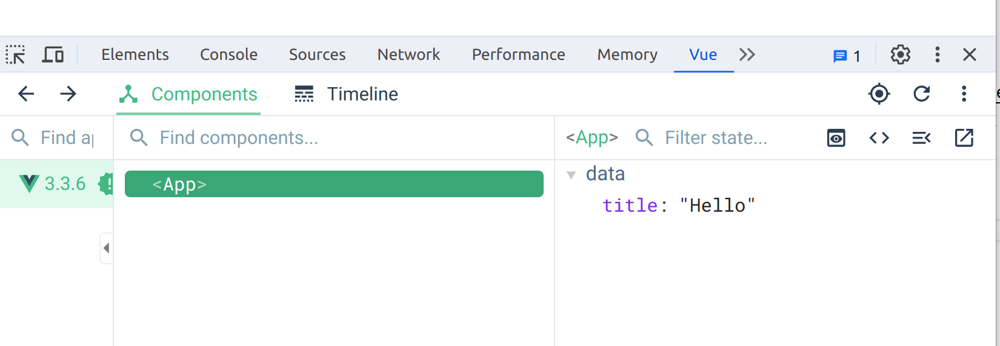

# Frontend Web Development - VueJS

Quentin Richaud

qrichaud.pro@gmail.com

---

# JS Frontend Frameworks

In the previous lecture, we saw some JS libraries (JQuery, lodash, axios…).

Now we are going to see JS frameworks. What is the difference between a library and a framework?

- **Library** : consists of functions that an application can call to perform a task.
- **Framework** : defines how a developer designs an application. In other words, the framework calls on the application code, rather than the other way around. 


---

# JS Frontend Frameworks


---

# Ecosystem of JS frameworks

Today 3 main frontend frameworks : Angular, React, VueJS.

Other rising frameworks : NextJS (using React), Nuxt (based on Vue), Svelte, …

The JS ecosystem is evolving (too) fast : in a year or two, maybe new frameworks will come in the spotlight.

---

# Angular

- Developped by google
- Not to be confused with AngularJS (developped by the same team, but older, now deprecated framework)
- Full fledged framework : provides an opiniated way to code everything in your app
- More complex, thus a bit hearder to learn
- More robust for big projects, enterprise projects
- Uses Typescript
- Uses a templating system (declarative paradigm)

---

# React

- Developped by facebook
- In itself, is just a rendering library
- Can be coupled with many tool to become "framework" like
- Many different ways of configuring a React project (so very different project architectures from one projet to another)
- Doesn't use templates, (imperative paradigm)
- Biggest share of the market

---

# Vue

- Looks like a lightweight Angular
- Uses a templating system (declarative paradigm)
- Provides less tooling by default than Angular (more modularity)
- More flexible and easy to setup into small projects

---

# The Vue framework

We are going to discover the Vue framework. 

Like most of JS libraries and tools : the official documentation is very good, and you can easily learn by yourself with it.

<https://vuejs.org/guide/introduction.html>

---

# Demonstration of VueJS

See `./demo_code/1_replace_JS_with_Vue`. This repository is a VueJS project. Setup and run
the project with the following commands :

```bash
$ npm install
$ npm run dev
```

---

# What is a Vue Component


Vue works with "components". A Component is small reusable part of the HTML interface, coupled with JS logic.

A Component is a HTML-like template (HTML enhanced with directives to write declarative logic) coupled with a JS object
that contains data and functions, that works with the template.

Once a component is developped, we can use it in other components with a novel HTML tag. For example, I make a component
named `MyComponent` : I can include it in the HTML template of other Vue components with `<my-component></my-component>`.

Thue VueJS app bootstrap itself by including the root Vue component of your application into a DOM node (see `main.js`). 
Then all the application is rendered by the tree of Vue components included from your root component.

---

# Vue components


---

# Vue components


---

All rendering is done by VueJS (that is frontend logic). You can see that the initial HTML document is quite empty.

---

# Vue Component Template Syntax

One way data binding

```vue
<template>
  <div id="app">
    <header>
      <div class="title">{{title}}</div>
    </header>
  </div>
</template>

<script>
export default {
  name: 'App',
  data: {
    title: 'My App Title'
  }
}
</script>
```

---

# Vue Component Template Syntax

Two ways data binding

```vue
<template>
  <div id="app">
    <header>
      <div class="title">{{title}}</div>
      <input v-model="title">
    </header>
  </div>
</template>

<script>
export default {
  name: 'App',
  data: {
    title: 'My App Title'
  }
}
</script>
```

*See demo_code 0*

---

# Chrome developper tools extension for VueJS

You can install this Chrome extension : https://chrome.google.com/webstore/detail/vuejs-devtools/nhdogjmejiglipccpnnnanhbledajbpd?hl=fr

It will give you a new tab in your chrome developpers tools, with practical tools 
to inspect the components of your Vue application.



---

# Vue Component Template Syntax

Conditionnal rendering. We can put `if`s and loops in our template.

```vue
<template>
  <div id="app">
    <header>
      <div class="title" v-if="displayTitle">{{title}}</div>
      <input v-model="title">
    </header>
  </div>
</template>

<script>
export default {
  name: 'App',
  data: {
    title: 'My App Title',
    displayTitle: true
  }
}
</script>
```

---

# Vue Component Template Syntax

Bind user events. 

```vue
<template>
  <div id="app">
    <header>
      <div class="title" v-if="displayTitle">{{title}}</div>
      <input v-model="title">
      <button @click="toggleTitle">Show/Hide title</button>
    </header>
  </div>
</template>

<script>
export default {
  name: 'App',
  data: {
    title: 'My App Title',
    displayTitle: true
  },
  methods: {
    toggleTitle: function() {
      this.displayTitle = !this.displayTitle;
    } 
  }
}
</script>
```

---

# Nesting components in VueJS

```vue
// Child component  
<template>
  <li>{{ text }}</li>
</template>

<script>
export default {
  name: 'TodoItem',
  data: {
    text: 'My todo text'  }
}
</script>
```


```html
// Parent component
<template>
  <div id="app-7">
    <todo-item></todo-item>
  </div>
</template>

<script>
import TodoItem from '.TodoItem.vue';

export default {
  name: 'App',
  components: {
    TodoItem
  }
}
</script>
```

---

# Passing data to nested components

```js
<template>
  <li>{{ text }}</li>
</template>

<script>
export default {
  name: 'TodoItem',
  // The todo-item component now accepts a
  // "prop", which is like a custom attribute.
  // This prop is called text.
  props: ['text']
}
</script>
```

```html
<div id="app-7">
  <!--
    Now we provide each todo-item with the todo object
    it's representing, so that its content can be dynamic.
  -->
  <todo-item
    :text="'My value'"
  ></todo-item>
</div>
```


---

# A few examples of the usage of VueJS

- In demo code 1 : opening and closing a menu. See the difference between the version
  with native JS, and the version using the VueJS framework
- In demo code 2 : an example of navigating between two panels, dynamically changing
  the main content of the page

---

# The demo project

For now, I have only put the HTML with raw sample data and no logic. I am going to refactor progressively this HTML into a Vue App.

First step : refactor the code into Vue components, for better code organization and reusability.

See how `App.vue` now imports Vue components `MainNavigation` and `WindowsList`, and `WindowsList` itself imports the component
`WindowsListItem`.

We need to declare the components used by a component, into its JS object 

```js
import MainNavigation from './components/MainNavigation.vue';
import WindowsList from './components/WindowsList.vue';

export default {
  name: 'App',
  components: {
    MainNavigation,
    WindowsList
  },
  /***/
```

---

# Implementing the demo step by step

Step 0 : I integrated all the HTML and CSS, but put no JS logic and
didn't organize my VueJS app in logical subcomponents.

Step 1 : I divided my app in subcomponents

---

# Step 2 : Transfering data between components

Now we want to bind data between our templates and the JS part of our components. This is how we are going to structure the data :


- `WindowsList` will hold the data with a list of windows. In its template we are doing a list of `WindowsListItem` component, one for each
  window instance with have in our data.
- `WindowsListItem` is responsible for displaying the actual window data, we need to transfer it from the `WindowsListItem` component.

For this, we are using the `prop` mechanism.

---

# Our demo project - Step 2


- setup the data of windows list in the `WindowsList` component
- generate with `v-for` a list of `WindowsListItem` components, for each window
- pass a single window object to each `WindowsListItem` component through its props

---

# Our demo project - Step 2

Note : 

- To use the `v-for` directive : we need to apply a unique `:key` prop to each element of the loop (we
  often use the `id` property of the objects we are looping on)
- `v-for="window in windows"` creates a `window` variable (iterator) accessible on elements of the for loop
- In the `WindowsListItem` template, we can use `{{window.name}}`, a prop is accessible like a data property
- In `WindowsListItem` we want to conditionnally apply a class (for the "open" or "closed" status), we use 
  the `:class` directive

---

# Our demo project - Step 3

Step 3 : we want to make each window item expandable on click

- We setup a data property `isExpanded` (boolean), that will reflect the expended status of the item
- We conditionally display the extended view based on the value of `isExpanded`
- We need to bind the "click" event on any click on the main row of a window item
- On this click event, we toggle the value of `isExpanded`

---

# Our demo projet - Step 4

Step 4 : Get real data from the backend through the HTTP API

In order to get data from the backend, we are going to use a 
small library to easily do Ajax : axios.

Note : this is one of the difference with a full fledged framework 
like Angular. Angular has already a built-in 
tool for ajax requests. Vue is more modular, and let you use your own ajax tooling.

---

# Our demo project : get data with ajax

Install axios

`npm install axios`

Run your backend server locally, or use the online backend server if you have deployed it.

I will run the backend locally on <http://localhost:3014>

Note : there is a difficulty in browsers to access data from a different origin than
when your webpage is hosted (localhost:5173 vs localhost:3014). In order to make the 
setup easier, in your assignment template project, I've configured a proxy 
(built-in tool from VueJS), to proxy the API 
directly to the same host than your frontend.

---

# Demo project : ajax

The JS code to make an ajax request with axios :

```js
let response = await axios.get('http://localhost:3014/api/windows');
let windows = response.data;
```

Ideally, we should put the HOST into a variable that can easily be configured.

Where do we put this code in our Vue component? 

We want the windows list to be loaded as soon as the component is created : we will put 
the code into a "lifecycle hook", that is a special function that Vue garantees will be called
at certain life step of the component.

In the `WindowList` component object : 

```js
created: async function() {
  let response = await axios.get(`${API_HOST}/api/windows`);
  let windows = response.data;
  this.windows = windows;
}
```

---

# Demo project : ajax

In a real world scenario, we should check the data obtained from the API, and be sure it's the expected
format.

We should also always process possible errors (e.g 500 error from the server), and display visual feedback 
when things are not working as expected. (For example : if you stop the backend, and still load the frontend,
it should display something like "Windows list can't be loaded").

We should also put some visual feedback when the requests are pending (loading animations).


---

# Demo project

Step 5 : Open or close a window on clicking the "Open windows" or "Close windows"

- We need to bind the "click" event
- We need to make an ajax call `PUT /api/windows/${id}/switch`
- We need to update our data when the request is done

Problem with updating the data : the data is held in `WindowsList` but the action to switch the 
window is done in `WindowsListItem`. In order to update the application data, we need to communicate 
upward from `WindowsListItem` to `WindowList`.

We do that using the event mechanism.

---

# Demo project

In the child component, emitting an event : 

`this.$emit('window-updated', updatedWindow)`.

In the parent component, it's the same syntax than native events such as "click" : 

`<windows-list-item @window-update="updateWindow"></windows-list-item>`.

And the payload (`updatedWindow`) will be passed as first parameter of the handler function.

---

# Demo project

Note : in the demo code, I chose to make the Ajax call in `WindowsListItem` to switch the window, 
and to communicate by event the data response.

I could design another system, in which on click, I communicate by event the fact that a window "switch"
button was clicked, and make the Ajax call and the data update is the `WindowsList` component.

In a real world app : 

- Again, we should check for errors on our ajax call. We should check that returned data is in the expected format
- We should handle the loading delay of the request. For example, we don't want the user to click several time
  the button (and send several Ajax requests in band). We should disable the button on first click, and re enable it once the request has finished.
- We could put a visual feedback (loading animation), that an asynchronous request is pending.

---


# Assignment

The assignment is due on the 12th november 2022 at midnight.

You will work in groups of 3. Register your groups of work here : <https://docs.google.com/spreadsheets/d/16LaaPem10MlZlZ5mOGlRzWxZM9DHsk24gNPkUaN2oz8/edit#gid=0>

You will build a frontend, that will use the backend you made in the course of Guillaume Ehret. Since you developped different backends,
you may choose one implementation of your work team, to build your frontend upon it.

You may use the example project provided in this course as a base for your work.

---

# Assignment

Mandatory functionalities for your frontend : 

- Implement the functionality of the "Delete window" button
- Add a form to the windows list page that allow the creation of new windows
- Implement all these functionalities for Rooms (listing rooms, creating new rooms, 
  deleting rooms), and setup
  the navigation menu in order to switch from windows list to rooms list.

Note : 

- I used bootstrap to style the elements (+ some custom CSS when needed, as you can see in the component `WindowsListItem`).
- In particular : for the navigation menu, I used <https://getbootstrap.com/docs/5.0/components/navs-tabs/#tabs>, check 
  bootstrap documentation to see which classes to use to make visual feedback on the navigation
- This lecture was short and glossed over the in-depths of Vue. Follow the Vue.js official guides if you want to be more comfortable with Vue

---

# Assignment

Optionnal features : 

- Polishing your interface : visual feedback on errors, loading animations. You can use Chrome Developper Tools to simulate a slow
  internet connection (under the tab "Network", Set the "Throttling" dropdown to "Slow 3G").
- Adding a way to rename windows and rooms
- Any other features you want to do (depending on the capabilities of your API)

To go further you can check :

- How to perform routing in your frontend (Single Page Application) with Vue Router <https://router.vuejs.org/>
- You may use 3rd party libraries, for example [vue-toasted](https://github.com/shakee93/vue-toasted) to display notification messages
  (feedback on errors for example)


---

# Assignment Delivery

You must send me a link to a git repository with your solution to the assignment. The git repository must contain a `README.md`
with clear instructions in order for someone cloning the repository to be able to run the frontend without issues.

I suggest you configure your frontend to use an online version of your API, this way the end user doesn't have to setup
your API locally in order to test your frontend.

The frontend is only expected to run locally, I don't ask you to deploy it online. (Although, the ones that are interested to do so
may look how to easily deploy a Vue application with [gitlab pages](https://cli.vuejs.org/guide/deployment.html#gitlab-pages)).

Send this to qrichaud.pro@gmail.com by the 15th november 2022.
